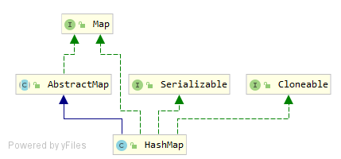
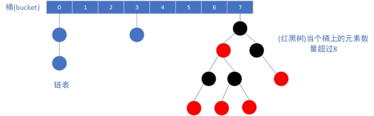

基于`jdk11`源码分析哈希表的实现，主要包含：哈希表的内部储存的数据结构是怎样的？哈希表是如何让`get`,`put`等些操作在常数时间内实现的，在当前哈希表"满"时，哈希表是如何进行扩容(`resize`)的？`负载因子(load factor)`与`容量(capacity)`这2个重要指标是如何影响哈希表的性能的？哈希表是如何让各个`元素(element or entry)`比较均与地散落在各个`桶(bucket)`上的？当存在较多冲突时，新版`jdk`的`HashMap`是如何优化的？

<!-- more -->

### 名词解释
在分析之前，先初步了解下下面文中用到的一些名词：

| 名词                  | 解释                                                         |
| --------------------- | :----------------------------------------------------------- |
| 哈希(hash)            | 预映射，将任意的输入经过哈希函数转换成对应固定长度的输出(即具体的某个对象对应一个固定的哈希编码)，如果2个散列值不一样，则2个对象也一定不一样 |
| 桶(bucket)            | 数组实现，哈希表具有多个桶，每个桶存放具有相同哈希编码的实体 |
| 实体(entry)           | 储存数据的最小单元                                           |
| 负载因子(load factor) | 默认值为0.75,表示当前哈希表的饱和度                          |
| 容量(capacity)        | 哈希表中桶的数量，默认的初始化大小:2^4，所允许的最大容量:2^30 |
| 再哈希(rehash)        | 当哈希表的实体总量大于负载因子与容量的乘积时，哈希表内部数据结构进行重新构建，桶的容量翻倍 |


### 整体介绍

- 提供Map接口的所有实现，大体上可以等价于Hashtable，除了其是非同步的(unsynchronized)还有允许空键(null key)，空值(null value)，不保证有序，特别的一点，不保证顺序不随时间而发生变化
- 假设哈希方法(hash function)能够适当地离散各个元素(element)到各个桶(buckets)，基本操作(put,get)提供常数时间的性能
- 遍历集合视图的时间跟桶的容量(capacity)成正比例关系，如果依赖于遍历的性能，一个很重要的点是桶的容量(capacity)不要设置过大或者负载因子(load factor)别设置过小
- 有2个参数影响HashMap的性能：初始化容量(initial capacity)以及负载因子(load factor)。在当前HashMap中的实体总量超过负载因子和容量的乘积时，哈希表将会进行再哈希操作
- 为了避免在遍历哈希表的同时因为哈希表内部结构被并发的修改(新增或者删除操作)而引起的一些不确定的问题，采用`fail-fast`机制，在遇到并发修改时，直接抛出`ConcurrentModificationException`异常


### 类图关系



### 内部存储的数据结构

`HashMap`内部由连续的桶(数组，长度等于`capacity`属性，2^n，最大为2^30)以及链表或者红黑树组成，正常情况下，在单个桶上遇到哈希冲突时(不同的哈希被离散到同一个桶上)，是采用链表来解决哈希冲突的，最新被插入的元素被放到链表的末尾。不过，在当个桶包含的元素数量过大时(超过8个)，为了优化查找效率(假设一个桶上包含n个元素，若使用链表结构，在进行查询等些操作时需要O(n)的时间复杂度，然而将其装换为红黑树之后，这些操作只需要O(log n)的时间复杂度)，使用红黑树进行储存。`HashMap`的数据结构大致如下图所示:



从源码的文档中可以看到，在随机的`hashCode`下，各个桶上所包含的元素数量大致符合`(exp(-0.5)*pow(0.5,k)/factorial(k)`的[泊松分布](http://en.wikipedia.org/wiki/Poisson_distribution)，各个元素出现的概率如下：
```
* 0:    0.60653066
* 1:    0.30326533
* 2:    0.07581633
* 3:    0.01263606
* 4:    0.00157952
* 5:    0.00015795
* 6:    0.00001316
* 7:    0.00000094
* 8:    0.00000006
* more: less than 1 in ten million
```
可以看到，当个桶上包含的元素数量大于8的概率是小于千万分之一的。

### 源码细节


#### hash函数

- 对key的hashCode()进行处理,高16位不变,但将其key的高16位与低16位进行异或处理,避免因为高位没有参与到下标的计算,从而引起的冲突，jdk源码上是这样描述的：

> Because the table uses power-of-two masking, sets of hashes that vary only in bits above the current mask will always collide. (Among known examples are sets of Float keys holding consecutive whole numbers in small tables.) 

```java
static final int hash(Object key) {
    int h;
    return (key == null) ? 0 : (h = key.hashCode()) ^ (h >>> 16);
}

// 在根据key定位桶的位置时使用: tab[(n - 1) & hash])
```

整个处理过程,大致如下:


#### put函数

- 对key的hashCode()做hash,然后计算对应的Index
-  如果没有发生碰撞，则直接放到bucket里
-  如果发生碰撞，并且该节点暂未存在，则以链表或者红黑树的形式添加到bucket上
- 如果碰撞导致链表过长，大于TREEIFY_THRESHOLD，则将链表装换为红黑树
- 如果该节点已经存在，则替换旧值// 如果添加后，当前节点数量超过允许的最大极限(负载因子 * 桶的数量)，则进行2倍的扩容

```java
public V put(K key, V value) {
    return putVal(hash(key), key, value, false, true);
}

final V putVal(int hash, K key, V value, boolean onlyIfAbsent,
               boolean evict) {
    Node<K,V>[] tab; Node<K,V> p; int n, i;
    // table为空则新建
    if ((tab = table) == null || (n = tab.length) == 0)
        n = (tab = resize()).length;
    // 未存在冲突则直接设置table[i]为当前的<k,v>
    if ((p = tab[i = (n - 1) & hash]) == null)
        tab[i] = newNode(hash, key, value, null);
    else {
        Node<K,V> e; K k;
        if (p.hash == hash &&
            ((k = p.key) == key || (key != null && key.equals(k))))
            e = p;
        // 如果table[i]为tree node,则直接将该<k,v>添加到树里
        else if (p instanceof TreeNode)
            e = ((TreeNode<K,V>)p).putTreeVal(this, tab, hash, key, value);
        else {
            for (int binCount = 0; ; ++binCount) {
                // 在链表尾部添加<k,v>
                if ((e = p.next) == null) {
                    p.next = newNode(hash, key, value, null);
                    if (binCount >= TREEIFY_THRESHOLD - 1) // -1 for 1st
                        // 链表 -> 红黑树
                        treeifyBin(tab, hash);
                    break;
                }
                // 原hash map已经存在该key,则替换掉原先的val值,并返回old val
                if (e.hash == hash &&
                    ((k = e.key) == key || (key != null && key.equals(k))))
                    break;
                p = e;
            }
        }
        if (e != null) { // existing mapping for key
            V oldValue = e.value;
            if (!onlyIfAbsent || oldValue == null)
                e.value = value;
            afterNodeAccess(e);
            return oldValue;
        }
    }
    ++modCount;
    // 超过 load factor * current capacity, resize
    if (++size > threshold)
        resize();
    afterNodeInsertion(evict);
    return null;
}
```


#### get函数

- 根据key的hashCode()进行hash,得到对应bucket的index
- 判断bucket上第一个节点的hash以及key是否与需要查询的key一致,如果一致,则返回对应的节点值
- 若节点类型为树,则在树上通过key.equals(k)查询,O(logn)// 若节点类型为链表,则在链表上通过key.equals(k)查询: O(n)

```java
public V get(Object key) {
    Node<K,V> e;
    return (e = getNode(hash(key), key)) == null ? null : e.value;
}

final Node<K,V> getNode(int hash, Object key) {
    Node<K,V>[] tab; Node<K,V> first, e; int n; K k;
    // bucket不为空
    if ((tab = table) != null && (n = tab.length) > 0 &&
        (first = tab[(n - 1) & hash]) != null) {
        // 检查第一个节点
        if (first.hash == hash && // always check first node
            ((k = first.key) == key || (key != null && key.equals(k))))
            return first;
        if ((e = first.next) != null) {
            // 在红黑树上查询
            if (first instanceof TreeNode)
                return ((TreeNode<K,V>)first).getTreeNode(hash, key);
            do {
            // 在链表上查询
                if (e.hash == hash &&
                    ((k = e.key) == key || (key != null && key.equals(k))))
                    return e;
            } while ((e = e.next) != null);
        }
    }
    return null;
}
```

#### resize 函数

- 当put时，如果目前的bucket占用程度已经超过了load factor所希望的比例，那么就会发生resize，resize的方法描述:

  > Initializes or doubles table size. If null, allocates in accord with initial capacity target held in field threshold. Otherwise, because we are using power-of-two expansion, the elements from each bin must either stay at same index, or move with a power of two offset in the new table.

大概意思: 因为使用的是2次幂的扩展，所以元素的位置要么在原位置，要么在原位置再移动2次幂的位置，避免了重新计算hash的时间

```java
final Node<K,V>[] resize() {
    Node<K,V>[] oldTab = table;
    int oldCap = (oldTab == null) ? 0 : oldTab.length;
    int oldThr = threshold;
    int newCap, newThr = 0;
    if (oldCap > 0) {
                // 超过最大容量就不再扩充了
        if (oldCap >= MAXIMUM_CAPACITY) {
            threshold = Integer.MAX_VALUE;
            return oldTab;
        }
        // 容量 * 2
        else if ((newCap = oldCap << 1) < MAXIMUM_CAPACITY &&
                 oldCap >= DEFAULT_INITIAL_CAPACITY)
            newThr = oldThr << 1; // double threshold
    }
    else if (oldThr > 0) // initial capacity was placed in threshold
        newCap = oldThr;
    else {               // zero initial threshold signifies using defaults
        newCap = DEFAULT_INITIAL_CAPACITY;
        newThr = (int)(DEFAULT_LOAD_FACTOR * DEFAULT_INITIAL_CAPACITY);
    }
    // 计算新的容量上限
    if (newThr == 0) {
        float ft = (float)newCap * loadFactor;
        newThr = (newCap < MAXIMUM_CAPACITY && ft < (float)MAXIMUM_CAPACITY ?
                  (int)ft : Integer.MAX_VALUE);
    }
    threshold = newThr;
    @SuppressWarnings({"rawtypes","unchecked"})
    Node<K,V>[] newTab = (Node<K,V>[])new Node[newCap];
    table = newTab;
    if (oldTab != null) {
        for (int j = 0; j < oldCap; ++j) {
            Node<K,V> e;
            if ((e = oldTab[j]) != null) {
                oldTab[j] = null;
                if (e.next == null)
                    newTab[e.hash & (newCap - 1)] = e;
                else if (e instanceof TreeNode)
                    ((TreeNode<K,V>)e).split(this, newTab, j, oldCap);
                else { // preserve order
                    Node<K,V> loHead = null, loTail = null;
                    Node<K,V> hiHead = null, hiTail = null;
                    Node<K,V> next;
                    do {
                        next = e.next;
                        // 原桶上的节点只存在2种可能: 1)继续放在原索引下标的位置; 2)放在原索引下标 + 原cap的位置
                        if ((e.hash & oldCap) == 0) {// new index = 原索引
                            if (loTail == null)
                                loHead = e;
                            else
                                loTail.next = e;
                            loTail = e;
                        }
                        else {// new index = 原索引 + 原cap
                            if (hiTail == null)
                                hiHead = e;
                            else
                                hiTail.next = e;
                            hiTail = e;
                        }
                    } while ((e = next) != null);
                    // 放到原索引位置
                    if (loTail != null) {
                        loTail.next = null;
                        newTab[j] = loHead;
                    }
                    // 放到原索引 + oldCap的位置
                    if (hiTail != null) {
                        hiTail.next = null;
                        newTab[j + oldCap] = hiHead;
                    }
                }
            }
        }
    }
    return newTab;
}
```


### 扩展知识
- Float类型的表示(共4字节,32bit) -- `符号位(1) 阶码(8) 尾数位(23)`

- Double类型的表示(共8字节,64bit) -- `符号位(1) 阶码(11) 尾数位(52)`

- [泊松分布](http://en.wikipedia.org/wiki/Poisson_distribution)

-  


### 参考链接
- `jdk-11.0.2`
- [https://yikun.github.io/2015/04/01/Java-HashMap%E5%B7%A5%E4%BD%9C%E5%8E%9F%E7%90%86%E5%8F%8A%E5%AE%9E%E7%8E%B0/](https://yikun.github.io/2015/04/01/Java-HashMap工作原理及实现/)