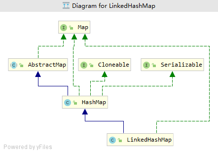

`LinkedHashMap`是基于`HashMap`实现的子类，支持`get`, `put`等些基本操作`O(1)`时间复杂度的支持，允许`null`的`mapping`，但与`HashMap`不同的一点是，其支持按照`mapping`被添加进来的顺序进行遍历(底层使用额外的双链表储存了各个被添加的元素)。还有特殊的一点，如果该`map`是以`access-ordered`方式构建的，可以用来构建简单的`LRU(最近最少使用)`的缓存，在满足一定条件时，`map` 自动淘汰一些过期元素

<!-- more -->

### 基本描述
- 基于`HashMap`和`双链表`并且具有可预知遍历顺序的`Map接口`实现，遍历顺序与`mapping`被添加进来时的顺序一致。跟HashMap不同之处在于，它维护一个运行于所有实体中的双链表，该链表定义了遍历的顺序
- 需要注意的是，如果重新插入一个`key`，插入顺序不会受到影响(这里指的应该是`accessOrder=false`的情景)
- 提供一个特别的构造方法，能够提供遍历顺序按照最少使用(`least-recently`)到最常使用(`most-recently`)，这种类型的Map比较符合构建LRU缓存的需求。` removeEldestEntry(Map.Entry) `方法可能需要被重写，从而在有新的mapping增加时，提供一个策略来自动删除比较旧的元素
- 跟HashMap类似，允许空的元素，一些基本的操作`(add, contains and remove)`提供常量时间的性能，对比于`HashMap`，因为维护双链表需要开销，不过性能只稍微低于`HashMap`（不过有一个地方除外: 全局遍历的性能比`HashMap`的要好，`LinkedHashMap`只需要遍历链表，而`HashMap`需要遍历整个桶）
- 非同步，可使用装饰模式`Map m = Collections.synchronizedMap(new LinkedHashMap(...))`将其转换为同步的`map`
- 在迭代遍历Map时，如果map内部结构发生修改，则会引起`fail-fast`，抛出`ConcurrentModificationException`异常。特别的一点，具有访问顺序(`access-ordered`)要求的map，仅仅是简单的查询方法例如: `get函数`也会引起内部结构的变化


### 类图结构



### 内部数据结构

依次插入如下数据，假设key: "Math", "English"经过hash函数处理后被映射到下标1上,Key: "Chinese"映射在下标4上
```java
LinkedHashMap<String, String> map = new LinkedHashMap<>();
map.put("Math", "90");
map.put("Chinese", "98");
map.put("English", "88");
```

在LinkedHashMap内部，里面桶以及双链表的结构如下图:


遍历map时，将直接遍历双链表，顺序与被插入的顺序一致:
```
{"Math"="90", "Chinese"="98", "English"="88"}
```

### 源码分析
#### 双链表节点数据结构

```java
static class Entry<K,V> extends HashMap.Node<K,V> {
    Entry<K,V> before, after;
    Entry(int hash, K key, V value, Node<K,V> next) {
        super(hash, key, value, next);
    }
}
```
- 基于`HashMap.Node`，新增属性`before`,`after`
- 使用双链表的一个好处是节点能够在删除时，不需要跟其它的节点关联，例如删除节点e，假设e的前后序节点都不为空，可直接这样进行删除:

```java
// 将e节点的前序节点的next指针指向e节点的后续节点
e.before.next = e.next;
// 将e节点的后序节点的before指针指向e的前序节点
e.next.before = e.before;
e.before = null;
e.next = null;
```

#### linkNodeLast(LinkedHashMap.Entry<K,V> p)函数
将当前节点p添加到双链表的尾部
```java
/**
 * The head (eldest) of the doubly linked list.
 */
transient LinkedHashMap.Entry<K,V> head;

/**
 * The tail (youngest) of the doubly linked list.
 */
transient LinkedHashMap.Entry<K,V> tail;

private void linkNodeLast(LinkedHashMap.Entry<K,V> p) {
    LinkedHashMap.Entry<K,V> last = tail;
    tail = p;
    // last为空,说明当前双链表暂未有元素,此时让head指向p
    if (last == null)
        head = p;
    else {
        // 设置p节点为双链表的尾节点
        p.before = last;
        last.after = p;
    }
}
```

#### transferLinks(LinkedHashMap.Entry<K,V> src, LinkedHashMap.Entry<K,V> dst)
在由普通节点(pain node)转树节点(tree node)或者树节点转普通节点后，更新双链表中对应节点的旧节点信息为新的节点信息

```java
private void transferLinks(LinkedHashMap.Entry<K,V> src,
                            LinkedHashMap.Entry<K,V> dst) {
    //src 原节点信息，转换之前的旧节点
    //dst 新节点信息，转换之后的新节点
    LinkedHashMap.Entry<K,V> b = dst.before = src.before;
    LinkedHashMap.Entry<K,V> a = dst.after = src.after;
    if (b == null)
        head = dst;
    else
        b.after = dst;
    if (a == null)
        tail = dst;
    else
        a.before = dst;
}
```

#### afterNodeRemoval(Node<K,V> e) 
在删除桶中对应的node节点后被调用，用来清除双链表对应的节点
```java
void afterNodeRemoval(Node<K,V> e) { // unlink
    LinkedHashMap.Entry<K,V> p =
        (LinkedHashMap.Entry<K,V>)e, b = p.before, a = p.after;
    p.before = p.after = null;
    // 若当前被删除节点为头节点，则设置当前节点的后序节点为头节点
    // 否则设置被删除节点的前序节点的后序指针指向被删除元素的后序节点
    if (b == null)
        head = a;
    else
        b.after = a;
    // 若当前被删除节点为链表的尾节点，则让tail指针指向被删除节点的前序节点
    // 否则，设置被删除节点对应的后序节点的前序指针指向被删节点的前序节点
    if (a == null)
        tail = b;
    else
        a.before = b;
}
```

#### afterNodeInsertion(boolean evict)
当有新的元素插入时执行，若满足`removeEldestEntry`时，则会删除LinkedHashMap中双链表对应的首个元素（从buckets和double-linked list结构中分别清除）
```java
void afterNodeInsertion(boolean evict) { // possibly remove eldest
    LinkedHashMap.Entry<K,V> first;
    if (evict && (first = head) != null && removeEldestEntry(first)) {
        K key = first.key;
        // 删除首个元素(最近最少使用)
        removeNode(hash(key), key, null, false, true);
    }
}
```
`evict` 参数的理解: 是否清除元素，只有在初始化构造map时(例如: 反序列,使用Map参数类型的构造方法创建对象)为false，其它时候为trues

#### afterNodeAccess(Node<K,V> e)
在元素被访问后(`get`,`put`等些方法)将其放置到双链表的尾部
```java
void afterNodeAccess(Node<K,V> e) { // move node to last
    LinkedHashMap.Entry<K,V> last;
    if (accessOrder && (last = tail) != e) {
        LinkedHashMap.Entry<K,V> p =
            (LinkedHashMap.Entry<K,V>)e, b = p.before, a = p.after;
        p.after = null;
        if (b == null)
            head = a;
        else
            b.after = a;
        if (a != null)
            a.before = b;
        else
            last = b;
        if (last == null)
            head = p;
        else {
            p.before = last;
            last.after = p;
        }
        tail = p;
        ++modCount;
    }
}
```

### 利用LinkedHashMap实现简单的LRU缓存
问题描述: [LeetCode LRU Cache](https://leetcode.com/problems/lru-cache/)
基于LinkedHashMap实现:
```java
class LRUCache {
    private LinkedHashMap<Integer, Integer> cache;
    public LRUCache(int capacity) {
        // 设置桶的初始容量为: cap / 0.75 + 1
        cache = new LinkedHashMap<Integer, Integer>((int)(capacity/0.75) + 1, 0.75F, true) {
                @Override
                public boolean removeEldestEntry(Map.Entry<Integer, Integer> eldest) {
                    // 当新增元素后cache的大小大于允许的最大容量时，淘汰旧元素
                    return cache.size() > capacity;
                }
            };
    }
    
    public int get(int key) {
         Integer val; 
         return (val = cache.get(key)) != null ? val : -1;
    }
    
    public void put(int key, int value) {
        cache.put(key, value);
    }
}
```

`注`: 当然感兴趣的话，也可以自己实现个双链表结构，基于HashMap实现类似的LRU缓存

### 参考资料
- `jdk-11.0.2`