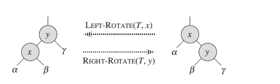
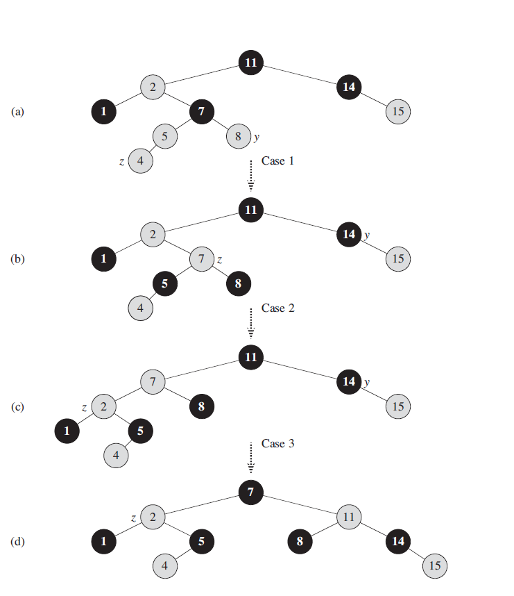
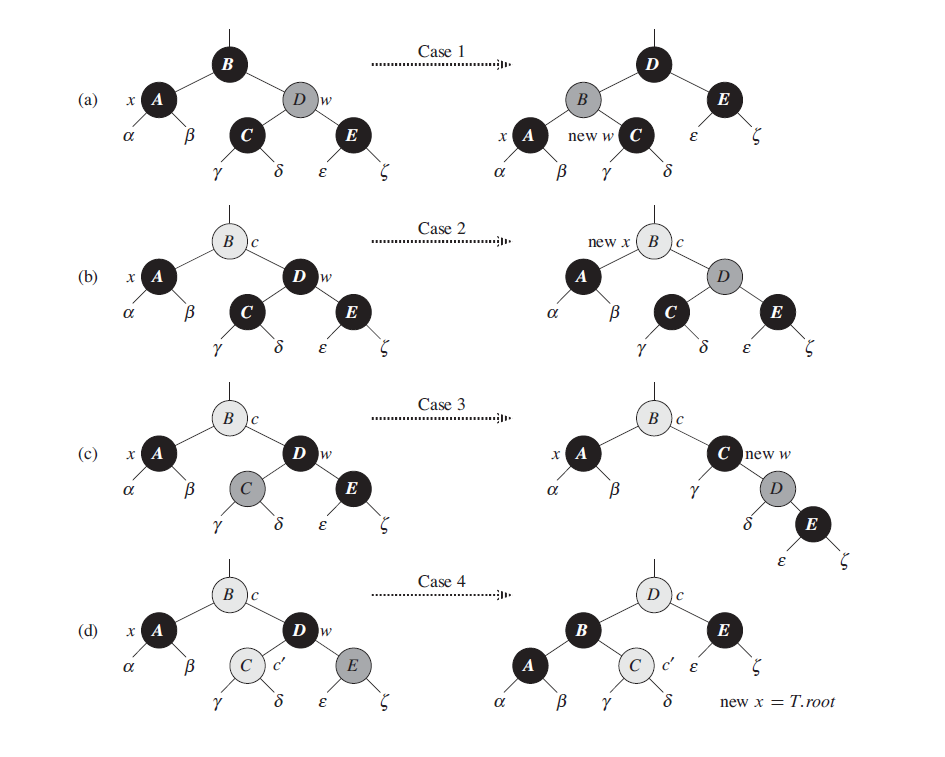

主要介绍了红黑树具有的5点性质，以及在进行插入，删除操作后，如何通过旋转和变色的操作来维护红黑树相关的性质

<!-- more -->

### 基本介绍
一般的`search`,`insert`,`remove`等操作的时间复杂度为`O(h)`，`h`为树的高度，如果树的高度比较大时，这些操作执行得可能会比较慢。红黑树是许多"平衡"搜索树的一种，可以保证在最坏情况下动态集合操作的时间复杂度为`O(n)`

### 红黑树的性质
红黑树是一棵二叉搜索树，它在每个结点上增加了一个存储位来表示结点的颜色，可以是`RED`或者`BLACK`。通过对任何一条从根结点到叶子结点的简单路径上各个结点的颜色进行约束，红黑树确保没有一条路径会比其它路径长出2倍，因而是近似于平衡的。
1. 每个结点或是红色或是黑色
2. 根结点是黑色的
3. 每个叶子节点(`null`)都是黑色的
4. 如果一个结点是红色的，则它的两个子结点都是黑色
5. 对每个结点，从该结点到其所有后代叶子结点的简单路径上，均包含相同数目的黑色结点


### 常见操作
#### 旋转
旋转: 一种能够保持二叉搜索树性质的局部操作，分别有左旋转，右旋转
`注(仅是个人理解)`: 左旋转，能够让左子树的深度+1;右旋转，能够让右子树深度+1，从而达到在不改变搜索树性质的同时，适当调整树的深度，避免搜索树出现链化



伪代码:
- 左旋转

```
LEFT-ROTATE(T,x):
y = x.right
x.right = y.left
if y.left != null
    y.left.p = x
y.p = x.p
if x.p == null
    T.root = y
elseif x == x.p.left
    x.p.left = y
else x.p.right = y
y.left = x
x.p = y
```

- 右旋转

```
RIGHT-ROTATE(T,x):
y = x.left
x.left = y.right
if y.right != null
    y.right.p = x
y.p = x.p
if x.p == null
    T.root = y
elseif x == x.p.left
    x.p.left = y
else x.p.right = y
y.right = x
x.p = y
```

#### 插入
往红黑树T上插入z结点

```
RB-INSERT(T,z):
y = null
x = T.root
while x != null
    y = x
    if z.key < x.key
        x = x.left
    else x = x.right
z.p = y
if y == null
    T.root = z
elseif z.key < y.key
    y.left = z
else y.right = z
z.left = null
z.right = null
z.color = RED
RB-INSERT-FIXUP(T,z)
```

`RB-FIXUP函数`处理了对应的3种情景(但是为什么这样处理，脑壳子转不过来 ┭┮﹏┭┮)
当新插入结点的父结点为红色时需要处理以下情景:
- case 1: z结点的uncle结点颜色为RED，此时将z.p 以及 uncle(z)的color设置为BLACK，并且加z.p.p颜色设置为RED
- case 2: z结点的uncle结点颜色为黑色，并且z为其父结点的右孩子，此时通过左旋转z.p结点，将问题转换为case 3
- case 3: z结点的uncle结点颜色为黑色，并且z为其父接待你的左孩子，设置z.p.color = BLACK，并对z.p.p结点进行右旋转


```
RB-INSERT-FIXUP(T,z):
while z.p.color == RED
    if z.p == z.p.p.left
        y = z.p.p.right//uncle node
        if y.color == RED//case 1
            z.p.color = BLACK
            y.color = BLACK
            z.p.p.color = RED
            z = z.p.p
        elseif z == z.p.right//case 2
            z = z.p//通过左旋转，将其转换为case 3
            LEFT-ROTATE(T,z)
        z.p.color = BLACK// case 3
        z.p.p.color = RED
        RIGHT-ROTATE(T,z.p.p)
    else(same as then clause with "right" and left exchanged)
T.root.color = BLACK
```
#### 删除

-`RB-TRANSPLANT`
使用v结点替换红黑树T中u结点

```
RB-TRANSPLANT(T,u,v):
if u.p == null
    T.root = v
elseif u.p.left == u
    u.p.left = u
else u.p.right = u
v.p = u.p
```

- `RB-DELETE(T,z)`
从红黑树中删除结点z
- 变量x指向y结点原来的位置(或y结点的位置)
- 只有当结点y的原颜色为BLACK时才需要对树结构进行调整，当y-original-color=RED时
    1) 树中的黑高没有改变
    2) 不存在2个相邻的红结点
    3) 如果y是红色，就不可能是根结点，所以根结点仍旧是黑色

```
RB-DELETE(T,z):
y = z
y-original-color = y.color
if z.left == null
    x = z.right
    RB-TRANSPLANT(T,z,z.right)
elseif z.right == null
    x = z.left
    RB-TRANSPLANT(T,z,z.left)
else 
    y = TREE-MINIMUM(z.right)
    y-original-color = y.color
    x = y.right
    if y.p == z
        x.p = y
    else RB-TRANPLANT(T,y,y.right)
        y.right = z.right
        y.right.p = y
    RB-TRANPLANT(T,z,y)
    y.left = z.left
    y.left.p = y
    y.color = z.color
if y-original-color == BLACK
    RB-DELETE-FIXUP(T,x)
```

删除结点z之后，可能会存在以下问题:
1) 如果y是原来的根结点，而y的一个红色孩子成为新的根结点，这就违反了性质2
2) 如果x与x.p都是红色的，则违反了性质4
3) 在树中移动y将导致先前包含y的任何简单路径上的黑结点个数减少1，因此，y的任何祖先都不满足性质5

- `RB-DELETE-FIXUP`
修正删除节点后的红黑树(脑壳疼 ┭┮﹏┭┮)




```
RB-DELETE-FIXUP(T,x):
while x != null and x.color == BLACK
    if x == x.p.left
        w = x.p.right
        if w.color == RED//case 1
            w.color = BLACK
            x.p.color == RED
            LEFT-ROTATE(T,x.p)
            w = x.p.right
        if w.left.color == BLACK and w.right.color == BLACK // case 2
            w.color = RED
            x = x.p
        elseif w.right.color == BLACK // case 3
            w.left.color = BLACK
            w.color = RED
            RIGHT-ROTATE(T,w)
            w = x.p.right
        w.color = x.p.color//case 4
        x.p.color = BLACK
        w.right.color = BLACK
        LEFT-ROTATE(T,x.p)
        x = T.root
    else (same as then clause with "right" and "left" exchanged)
x.color = BLACK
```

### 总结
关于红黑树在插入删除元素之后的调整(特别是删除后的调整操作)，暂时理解得不是太好，后面需要再继续学习掌握

### 参考
- 算法导论第13章